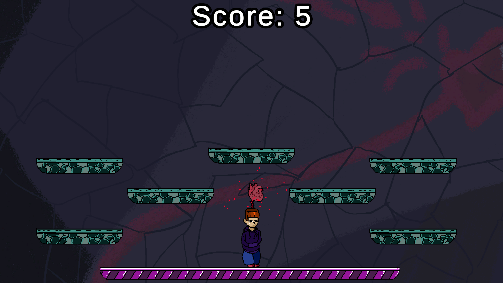
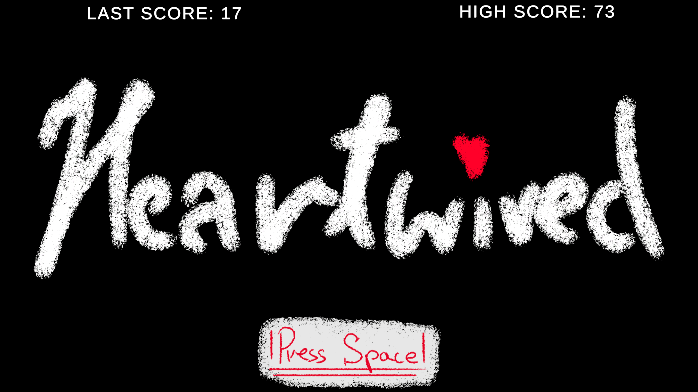

# HeartWired

An action game built in Unity, focused on movement, dodging and surviving dangerous obstacles.

## About

HeartWired is a small action game created as a game development project.

The player must move through the level while avoiding incoming projectiles and navigating platforms that can disappear.

The game focuses on movement, timing and quick reactions.

## Features

* Player movement
* Projectile-based hazards
* Disappearing platforms
* Fast-paced gameplay
* Action-oriented gameplay

## Built With

* Unity
* C#

## My Work

For this project, I worked on the gameplay systems, including player movement, projectile behaviour, platform mechanics and game logic.

## Platform

Windows

## Play

[Play HeartWired on itch.io](https://kaspil.itch.io)
